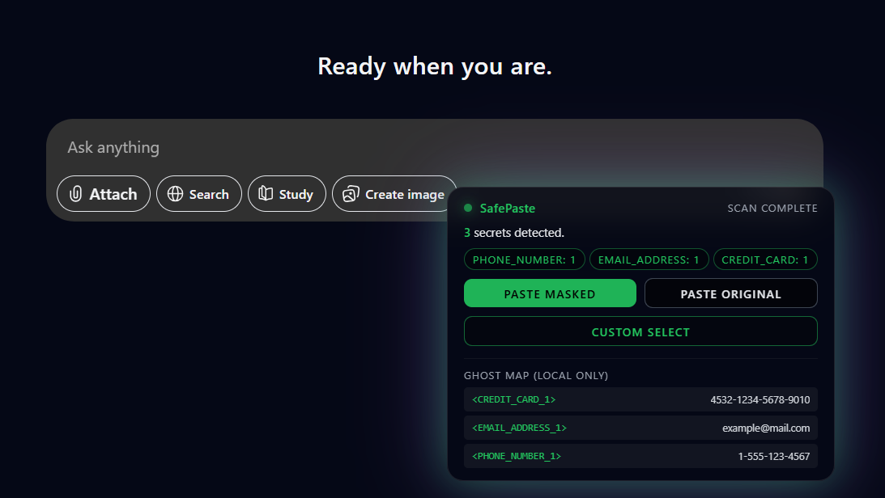

# 🔒 SafePaste - Privacy-First AI Clipboard Layer

> **Intercept, analyze, and redact PII/secrets before pasting into AI assistants (ChatGPT, Gemini, etc.)**

[](https://opensource.org/licenses/MIT)
[](https://github.com/gautamjkr/safe-paste)
[](https://reactjs.org/)
[](https://www.typescriptlang.org/)

**📖 [Documentation Website](https://gautamjkr.github.io/safe-paste/)** | **📚 [GitHub Wiki](https://github.com/gautamjkr/safe-paste/wiki)**

---

## 🎯 Overview

**SafePaste** is a privacy-first Chrome extension that uses **aggressive client-side PII detection** to identify and redact sensitive information before it reaches AI text areas. It gives users granular control over what gets pasted, with an opt-in keyboard shortcut for maximum privacy.

### The Problem

When using AI assistants like ChatGPT or Google Gemini, users often paste sensitive information (phone numbers, emails, credit cards, API keys, passwords, etc.). **This data is sent to third-party AI services**, potentially violating privacy regulations (GDPR, HIPAA, etc.) and creating security risks.

### The Solution

SafePaste acts as a **privacy firewall** between your clipboard and AI assistants:
- **Opt-in via Keyboard Shortcut**: Use `Ctrl+Alt+V` (or `Cmd+Alt+V` on Mac) to trigger SafePaste
- **Aggressive Detection**: Comprehensive regex patterns detect 25+ types of sensitive data
- **Client-side Processing**: All detection happens locally in your browser
- **Granular Control**: Three paste options - Mask All, Paste Original, or Custom Select
- **100% Local**: No external API calls, no data transmission, no storage



---

## 🛡️ Key Features

✅ **Opt-in design** - Normal paste (`Ctrl+V`) works normally  
✅ **25+ entity types detected** - Phone, email, credit cards, API keys, passwords, private keys, and more  
✅ **100% local processing** - All detection happens in your browser  
✅ **No external libraries** - Self-contained detection logic for maximum security  
✅ **Chrome Web Store compliant** - Self-contained, minimal permissions  
✅ **Granular control** - Choose which entities to redact via Custom Select  

---

## 🚀 Quick Start

### Prerequisites

- **Node.js 18+** and npm
- **Chrome/Chromium browser**

### Installation

```bash
# 1. Clone the repository
git clone https://github.com/gautamjkr/safe-paste.git
cd safe-paste
git checkout main

# 2. Install dependencies
npm install

# 3. Build the extension
npm run build
```

### Load in Chrome

1. Open `chrome://extensions/`
2. Enable **Developer mode** (top right)
3. Click **Load unpacked**
4. Select the `dist` folder

---

## 📖 Usage

### Keyboard Shortcuts

| Shortcut | Action |
|----------|--------|
| `Ctrl+V` / `Cmd+V` | Normal paste (works as usual) |
| `Ctrl+Alt+V` / `Cmd+Alt+V` | SafePaste (triggers PII detection) |

### Basic Workflow

1. Navigate to ChatGPT (`chatgpt.com`) or Gemini (`gemini.google.com`)
2. Click in a text area to focus it
3. Copy content containing PII to your clipboard
4. Press `Ctrl+Alt+V` (or `Cmd+Alt+V` on Mac) to trigger SafePaste
5. Ghost Overlay appears showing detected entities
6. Choose:
   - **Paste Masked**: Redact all detected entities
   - **Paste Original**: No redaction
   - **Custom Select**: Choose which entities to redact

### Example

**Input:**
```
My phone number is +1-555-123-4567. 
Email: example@mail.com
Credit card: 4532-1234-5678-9010
```

**Masked Output:**
```
My phone number is <PHONE_NUMBER_1>. 
Email: <EMAIL_ADDRESS_1>
Credit card: <CREDIT_CARD_1>
```

---

## 📊 Detected Entity Types

The aggressive PII detector can identify **25+ types** of sensitive information:

**Personal Information**: Phone numbers, emails, SSNs, passport numbers, driver licenses, dates of birth, person names

**Financial Information**: Credit cards, bank accounts, IBANs, SWIFT codes, Bitcoin/Ethereum addresses

**Network & System**: IP addresses (IPv4/IPv6), MAC addresses, URLs

**Security & Authentication**: API keys (Stripe, AWS, Google), passwords, JWT tokens, AWS keys, private keys (RSA, DSA, EC, OpenSSH, PGP)

**Other**: UUIDs, dates, locations (addresses, ZIP codes, coordinates)

> 📚 **For detailed information about the detection engine, see the [GitHub Wiki](https://github.com/gautamjkr/safe-paste/wiki)**

---

## 🔐 Security

### What SafePaste Does

✅ Opt-in keyboard shortcut for SafePaste  
✅ Aggressive PII detection with 25+ entity types  
✅ 100% local processing in your browser  
✅ Never sends data to external servers  
✅ Never stores data in databases  
✅ No external libraries - self-contained  
✅ Chrome Web Store compliant  

### What SafePaste Doesn't Do

❌ Intercept normal paste operations  
❌ Store raw secrets or PII  
❌ Send data to third-party services  
❌ Make external API calls  
❌ Require backend infrastructure  
❌ Track user behavior  

---

## 🛠️ Development

### Project Structure

```
safepaste/
├── src/
│   ├── contentScript.tsx    # Main content script
│   ├── piiDetector.ts       # Client-side PII detection
│   ├── background.ts        # Background service worker
│   ├── overlayMount.tsx    # Overlay mounting logic
│   └── overlay/
│       └── GhostOverlay.tsx # Overlay UI component
├── dist/                    # Built extension
├── manifest.json
└── package.json
```

### Commands

```bash
npm run dev    # Development mode (watch for changes)
npm run build  # Build for production
```

### Tech Stack

- **Extension**: React 18, TypeScript, Vite, Tailwind CSS
- **PII Detection**: Client-side regex patterns and heuristics
- **Build Tool**: Vite

---

## 🐛 Troubleshooting

**Extension not working?**
- Check extension is enabled in `chrome://extensions`
- Verify you're on a supported site (`chatgpt.com` or `gemini.google.com`)
- Use `Ctrl+Alt+V` (not just `Ctrl+V`)
- Check browser console for errors (F12)

**Detection not working?**
- The detector uses aggressive patterns and may have false positives
- Very short or unusual formats may not be detected
- Prioritizes privacy protection over perfect accuracy

---

## 📚 Resources

- **📖 [Documentation Website](https://gautamjkr.github.io/safe-paste/)** - Complete documentation and examples
- **📚 [GitHub Wiki](https://github.com/gautamjkr/safe-paste/wiki)** - Technical details, detection engine, and architecture
- **🐛 [Report Issues](https://github.com/gautamjkr/safe-paste/issues)** - Found a bug? Let us know!

---

## 📝 License

This project is licensed under the MIT License - see the [LICENSE](LICENSE) file for details.

---

## 🎯 Roadmap

- [ ] Support for more AI platforms (Claude, Perplexity, etc.)
- [ ] Custom entity recognizers (user-defined patterns)
- [ ] Multi-language support
- [ ] Browser extension for Firefox/Edge
- [ ] Configurable detection sensitivity levels

---

**Built with 🔒 for privacy-first AI interactions.**
